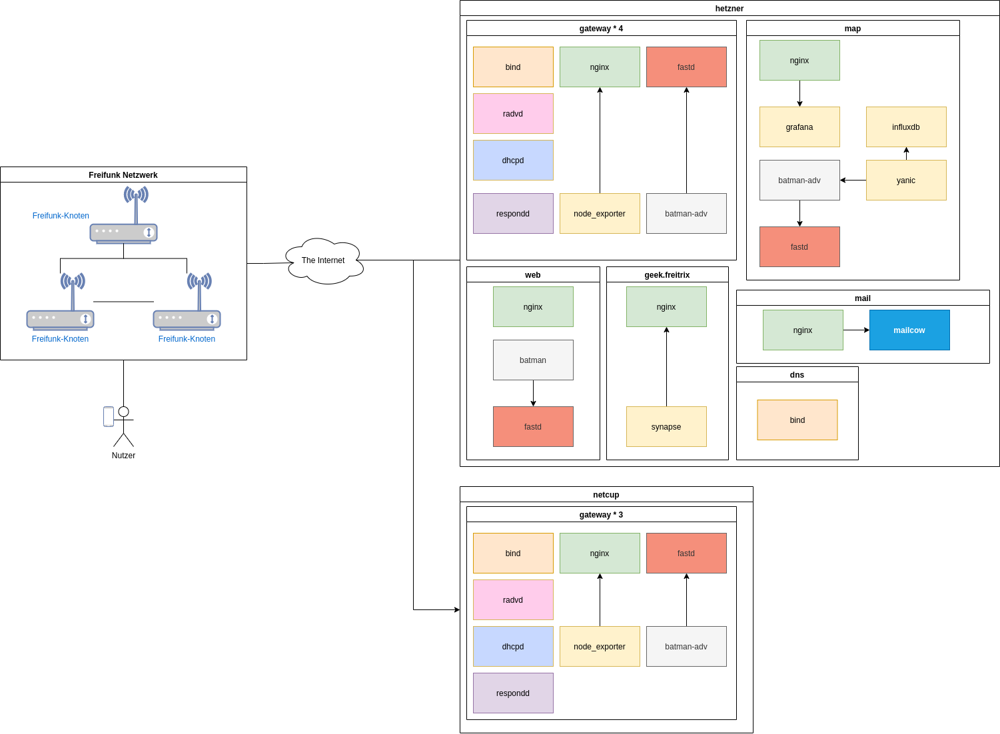

.. toctree::
   :maxdepth: 2
   :caption: Inhalte

Gateway Konfiguration
=====================
Dies ist die Dokumentation für die Gateways von Freifunk Südholstein.

In 2021 haben wir für die Einrichtung der Gateways auf Ansible umgestellt.
Davor war die Einrichtung eines Gateways ein manueller Prozess, der bereits bei kleineren Fehlern zu stundenlangen Rätseln führen konnte.

Ansible verkürzt die Einrichtung eines Gateways auf etwa 30min.

Unser Ansible Repository liegt auf GitHub: https://github.com/ffsh/ansible

Ansible installieren
--------------------
Ansible muss auf deinem lokalen System installiert werden.
In den meisten Linux Distributionen wirst du ein oder mehrere Ansible Pakete finden.
Unter Manjaro ist das "ansible" Paket ausreichend.
Mehr Optionen findest du hier:
https://docs.ansible.com/ansible/latest/installation_guide/intro_installation.html

Struktur
--------
Unser Ansible Repository ist relativ einfach gehalten, dadurch bleibt es übersichtlich.
Es ist allerdings auch nicht perfekt.

setup.yml
^^^^^^^^^
Hier werden neben ein paar Einstellungen vor allem die Rollen definiert und in welcher Reihenfolge sie auf dem Gateway angewendet werden sollen.

hosts.yml
^^^^^^^^^
Hier werden alle variablen, welche von den Rollen benötigt werden gespeichert. Abgesehen von den Geheimen natürlich.
Die YAML Struktur empfiehlt sich zur besseren Übersichtlichkeit.

host_vars/
^^^^^^^^^^
Hier gibt es pro Gateway eine Datei mit verschlüsselten Inhalt.
Dazu gehören der private fastd key sowie optional eine Wiregaurd Konfiguration für einen "exit" VPN.

roles/
^^^^^^
Hier werden die Rollen gespeichert, wenn etwas nicht funktioniert liegt der Fehler vermutlich hier.
Die Rollen fokussieren sich in der Regel auf genau eine Komponente und ihre Abhängigkeiten.

Secrets anlegen und bearbeiten
------------------------------
Für unser Gateway brauchen wir natürlich auch geheime Daten, welche wir nicht öffentlich im git Repository ablegen wollen.
Dafür bietet Ansible eine integrierte Funktion, welche eine verschlüsselte Datei mit den gewünschten Daten erstellt.
Die Readme Datei im Repository erklärt, wie neue Secrets erstellt werden und wie man sie bearbeitet.

Mehr zu diesem Thema: https://docs.ansible.com/ansible/latest/user_guide/vault.html

Hinweise zur Nutzung
--------------------
Ansible ist relativ einfach zu benutzen, in der Readme des Repository findest du die üblichen nützlichen Befehle.
Standardmäßig wird Ansible eine Änderung auf allen konfigurierten Gateways einspielen.
Manuelle Änderungen auf einem Gateway sind ok, sie sollten allerdings so schnell wie möglich in der entsprechenden Ansible Rolle festgehalten werden.
Es empfiehlt sich, diese Anpassungen zu testen.
Es ist ratsam sich beim Schreiben von Rollen bei den Standard Ansible Rollen zu bedienen, das ist allerdings nicht immer möglich.

Rollen
------
Die Rollen enthalten die Skripte welche auf den Gateways ausgeführt werden.
Sie sollen den Server durch eine bestimmte Konfiguration in ein Gateway verwandeln.

Architektur
-----------
Dieser Abschnitt soll die Architektur unserer Gateways beschreiben.

Hardware
^^^^^^^^
Für die "Hardware" setzen wir aktuell die kleinsten virtuellen Maschinen von Hetzner und Netcup ein und fahren mit diesem System sehr bisher sehr gut.
Die Knoten verteilen sich mehr oder weniger gleichmäßig über alle Gateways.

VPN
^^^
Wir setzen als VPN Lösung zwischen Knoten und Gateway und auch zwischen den Gateways sowie den Servern für die Karte und die Firmware aktuell auf fastd.
fastd ist nicht die beste VPN Lösung und zeigt auf den üblichen Routern keine besonders gute Performance, ist aber relativ einfach in der Handhabung und funktioniert reibungslos mit Batman Advanced.

Als "Exit VPN" setzen wir Wireguard ein, um uns vor urheberrechtlichen Problemen zu schützen.
Wireguard ist sehr performant und ist für diesen Fall sehr einfach zu konfigurieren.