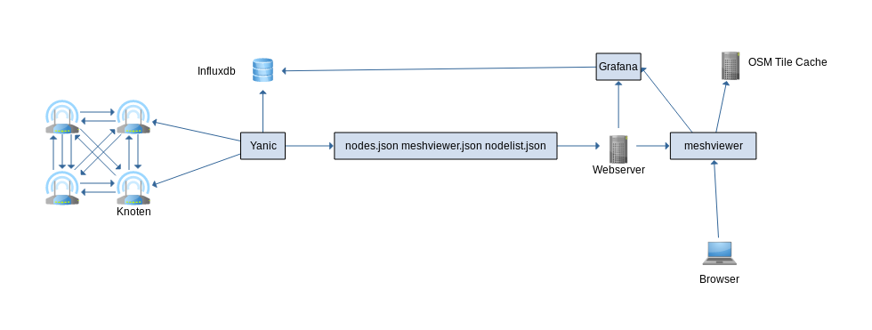

.. toctree::
   :maxdepth: 2
   :caption: Inhalte

meshviewer
==========

Die Folgenden Schritte dienen dazu, eine Karte anzuzeigen. Dies lässt
sich auch auf einem vom Gateway getrennten System durchführen.

Vorraussetzungen
----------------

Für einen Kartenserver brauchen wir einen Server mit einem aktuellen Linux, diese Anleitung geht von Debian 9 aus.
Die Hardware Anforderung hängen von der Größe und der zu erwartenden Last der Community ab.
Bei uns läuft die Karte auf einem der Gateways mit 4 VCores und 4GB RAM und es gab keine Probleme.

Eine Anbindung an das entsprechende Freifunk Netzwerk ist natürlich auch notwendig.

yanic
-----

`yanic <https://github.com/FreifunkBremen/yanic>`__ sammelt von den
Knoten Daten, welche dann auf einer Karte angezeigt werden können,
früher wurde hierfür Alfred benutzt. yanic ist in go geschrieben also
installieren wir eine neue Version von go.
`golang <https://golang.org/dl/>`__

Als erstes wechseln wir in den `root` user.
::

   sudo su

::

   wget https://dl.google.com/go/go1.15.5.linux-amd64.tar.gz
   # Bitte sha256 vergleichen https://golang.org/dl/
   tar -C /usr/local -xzf go1.15.5.linux-amd64.tar.gz
   rm go1.15.5.linux-amd64.tar.gz

In :code:`~/.bashrc`

::

   GOPATH=/opt/go
   PATH=$PATH:/usr/local/go/bin:$GOPATH/bin

Hier musst du dich einmal abmelden und neu anmelden damit die Variablen auch gesetzt werden.

Nach dem Anmelden kann man prüfen ob die Variablen korrekt gesetzt wurden.

::

  echo $GOPATH
  /opt/go

Mit :code:`whereis` go prüfen ob go gefunden wird:

::

   go: /usr/local/go /usr/local/go/bin/go

Dann wird yanic installiert.

::

   go get -v -u github.com/FreifunkBremen/yanic

Die Konfiguration von Yanic wird in :code:`/etc/yanic.conf` angelegt:

.. literalinclude:: configs/yanic.conf

Wir können testen ob yanic funktioniert in dem wir eine manuelle Anfrage
stellen hier an das Gateway Hopfenbach:

::

   yanic query --wait 5 br-ffsh "fddf:0bf7:80::128:1"

Damit yanic auch als Deamon läuft legen wir noch einen Service an.

::

    sudo cp /opt/go/src/github.com/FreifunkBremen/yanic/contrib/init/linux-systemd/yanic.service /lib/systemd/system/yanic.service
    sudo systemctl daemon-reload

influxdb
--------

Influxdb dient als Datenbank für :code:`yanic`

::

   wget -qO- https://repos.influxdata.com/influxdb.key | sudo apt-key add -
   source /etc/lsb-release
   echo "deb https://repos.influxdata.com/${DISTRIB_ID,,} ${DISTRIB_CODENAME} stable" | sudo tee /etc/apt/sources.list.d/influxdb.list

::

   sudo apt install influxdb influxdb-client

Nun sichern wir die influxdb ab :code:`/etc/influxdb/influxdb.conf`

Hier werden nur die empfohlenen Anpassungen beschrieben: Noch vor der
:code:`[meta]` Sektion setzen wir, sonst wäre der port 8088 überall offen.

::

   bind-address = "localhost:8088"

Weiter unten bei :code:`[admin]` das gleiche:

::

   bind-address = "localhost:8083"

kurz danach in :code:`[http]`

::

   bind-address = "localhost:8086"

::

   systemctl restart influxdb

Nun sollte influxdb nur noch auf localhost erreichbar sein, prüfen kann
man dies mit :code:`netstat -tlpn`

Grafana
-------

Grafana kann Graphen erstellen welche im meshviewer eingebunden werden
können. Hier wird
`Grafana <http://docs.grafana.org/installation/debian/>`__ über eine
Repository installiert.

::

   deb https://packagecloud.io/grafana/stable/debian/ stable main
   curl https://packagecloud.io/gpg.key | sudo apt-key add -
   sudo apt-get update
   sudo apt-get install grafana

Da Grafana bei uns hinter einem Proxy laufen soll, setzen wir auch hier alle IPs auf :code:`localhost`.
Am besten einmal am Ende prüfen ob alles richtig konfiguriert ist mit :code:`netstat -tlpn`.

Ein wichtiger Punkt ist der öffentliche Zugang, damit die Statistiken auch von Besuchern abgerufen werden können.

::

   #################################### Anonymous Auth ##########################
   [auth.anonymous]
   # enable anonymous access
   enabled = true

   # specify organization name that should be used for unauthenticated users
   org_name = Freifunk Südholstein

   # specify role for unauthenticated users
   org_role = Viewer

Die Organisation kann man als Admin in Grafana anlegen.

meshviewer
----------

Für den Meshviewer installieren wir als erstes nodejs und yarn

nodejs
~~~~~~

Wir brauchen ein aktuelles nodejs das finden wir auf
`nodejs.org <https://nodejs.org/en/download/package-manager/>`__ Wir
benutzen die LTS Variante 8.x

::

   curl -sL https://deb.nodesource.com/setup_8.x | sudo -E bash -
   sudo apt-get install -y nodejs

yarn
~~~~

Dann installieren wir
`yarn <https://yarnpkg.com/en/docs/install#linux-tab>`__

::

   curl -sS https://dl.yarnpkg.com/debian/pubkey.gpg | sudo apt-key add -
   echo "deb https://dl.yarnpkg.com/debian/ stable main" | sudo tee /etc/apt/sources.list.d/yarn.list
   apt install yarn

meshviewer-rgb
~~~~~~~~~~~~~~

Nun installieren wir den `meshviewer <https://doc.meshviewer.org/>`__
selbst. Im web Verzeichnis :code:`/var/www/`

::

   git clone https://github.com/ffsh/meshviewer.git
   cd meshviewer
   yarn

Nun muss die Konfiguration in :code:`meshviewer/config.js` eventuell noch
angepasst werden.

Danach yarn run gulp Nun muss nur noch ein Webserver meshviewer/build
ausliefern.

Tile-cache mit nginx
---------------------

Für den Meshviewer benötigt man einen Tile-Server, der die Karte als einzelne Kacheln ausliefert.
Wir verwenden dabei das kostenlose und freie Angebot von OpenStreetMap. Damit die Server von OpenStreetMap weniger stark belastet werden verwenden wir einen Tile-Cache. Bei einer Anfrage für eine Karten-Kachel fragt der Browser den Cache, hat dieser die Datei bereits, so liefert er sie direkt aus. Hat er sie nicht, so fragt er bei den OpenStreetMap Servern und speichert die Datei in seinem Cache.
Für die einfache Umsetzung haben ein paar Freifunker an einer Konfiguration für nginx gearbeitet, welche genau das umsetzt.

Voraussetzungen:
- nginx erreichbar unter der entsprechenden Domain
- TLS mit gültigem Zertifikat (Let's Encrypt)
- ein wenig Speicherplatz

.. literalinclude:: configs/nginx-tilecache.conf

Grafna cache mit nginx
---------------------

Da Grafana ab version 7.0 das rendern der images, welche wir auf der Karte einbetten, anders rendert als früher mussten wir einen Cache einrichten.
Siehe https://github.com/ffrgb/meshviewer/issues/304

Basierend auf den Kommentaren haben wir auch eine Konfiguration zusammengestellt.

.. literalinclude:: configs/nginx-grafana.conf
